# Minhas aulas da Imersão Java Alura

## Objetivo Aula 1:

### Consumir uma API de filmes com Java

- Desafios

1. Fazer a conexão com a API.

2. Fazer a extração dos dados com uma classe própria disponibilizada em aula.

3. Fazer a impressão em tela dos seguintes dados dos filmes: título, imagem, pontuação.

4. Com o desafio proposto pelos mentores foi refatorada a pontuação de modo a possuir um
melhor layout com cores e emojis.

## Print do projeto da Aula 1

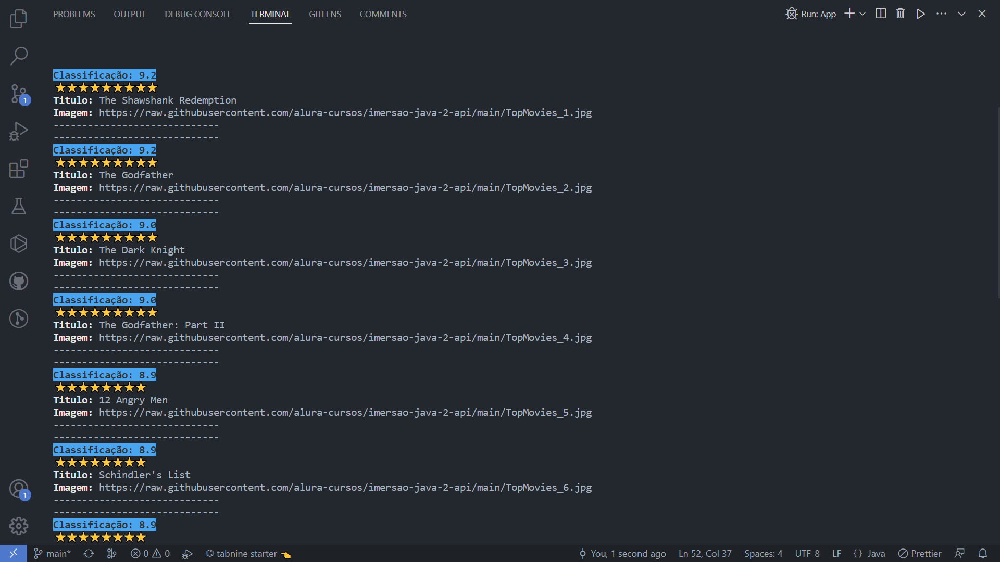

## Objetivo Aula 2:

### Gerar figurinhas para o WhatsApp

- Desafios

1. Criar diretório de saída das imagens, se ainda não existir.

2. Centralizar o texto na figurinha.

3. Colocar outra fonte como a Comic Sans ou a Impact, a fonte usada em memes.

4. Colocar contorno (outline) no texto da imagem.

## Prints dos projetos da Aula 2

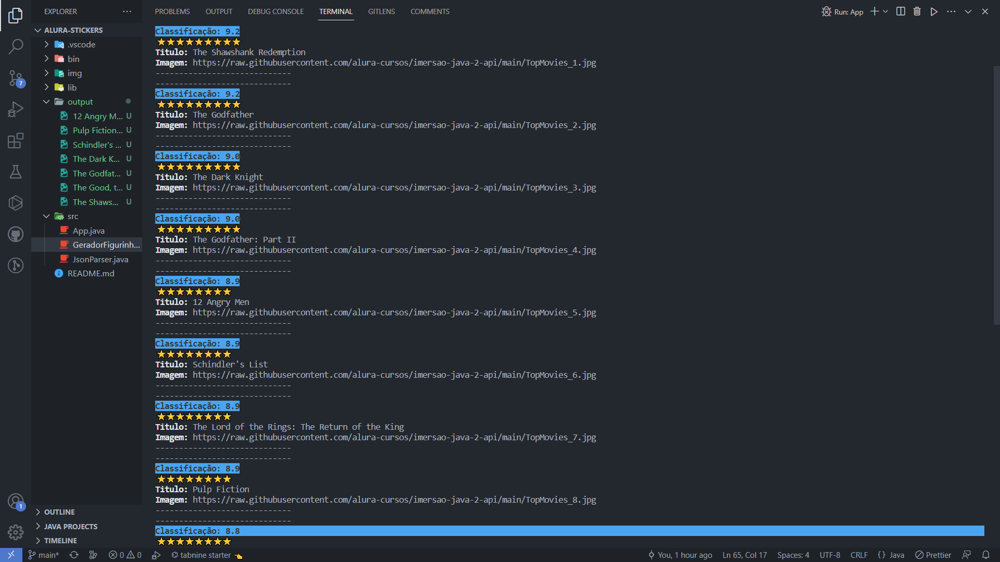

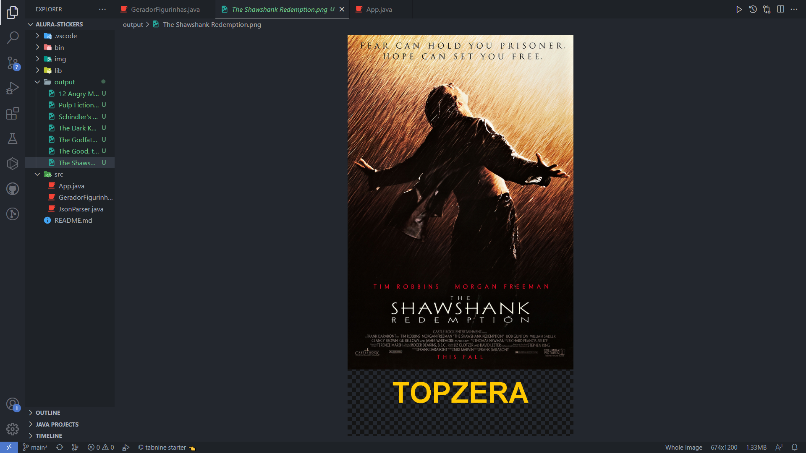

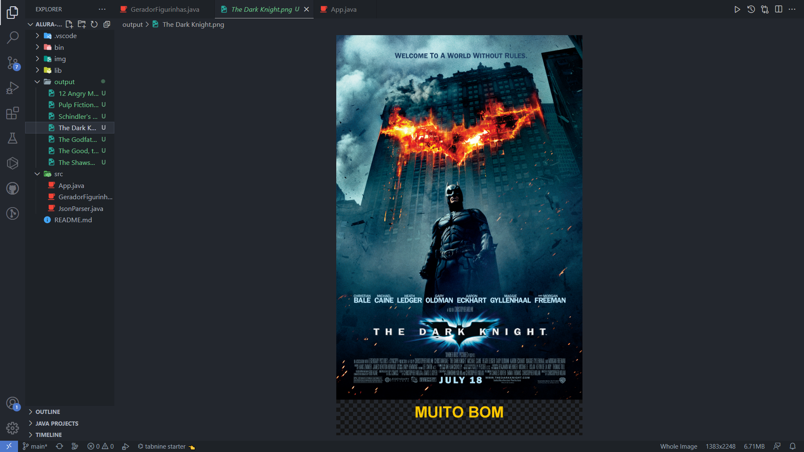

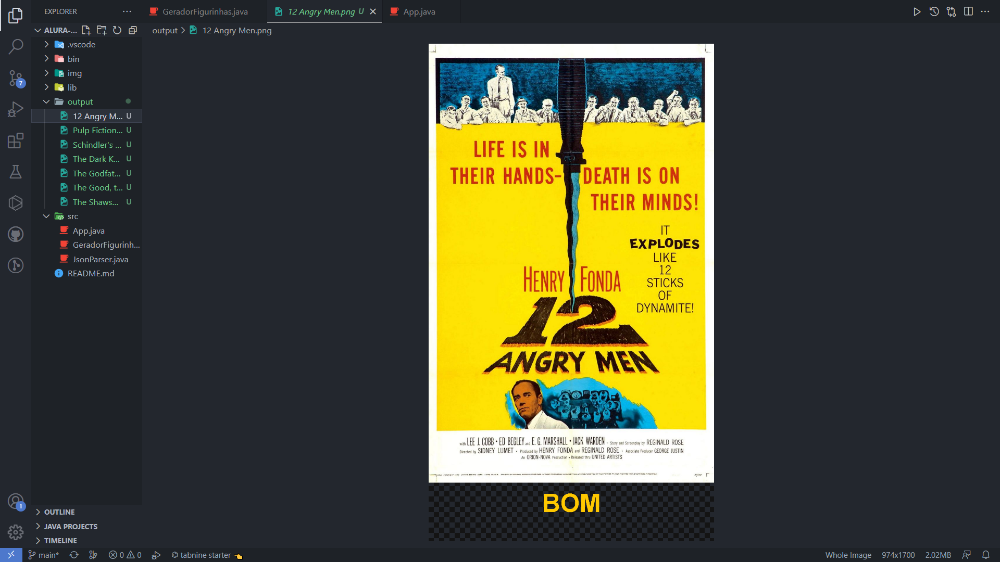

## Objetivo Aula 3:

### Ligando as pontas, refatoração e orientacão a objetos

- Desafios

1. Transformar a classe que representa os conteúdos em um Record.

2. Criar as suas próprias exceções e usá-las na classe que implementa o cliente HTTP.

3. Usar Streams e Lambdas, para mapear uma lista em uma outra.

4. Criar uma Enum que une, como configurações, a URL da API e o extrator utilizado.

## Prints dos projetos da Aula 3

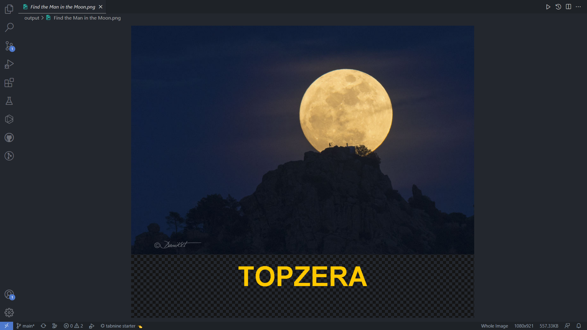

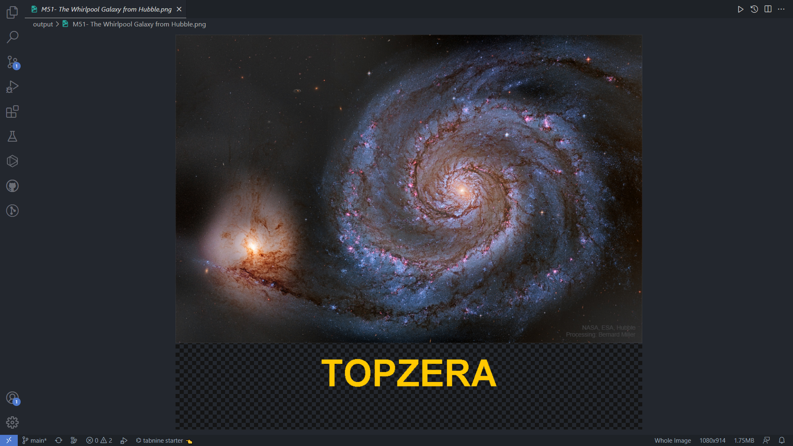

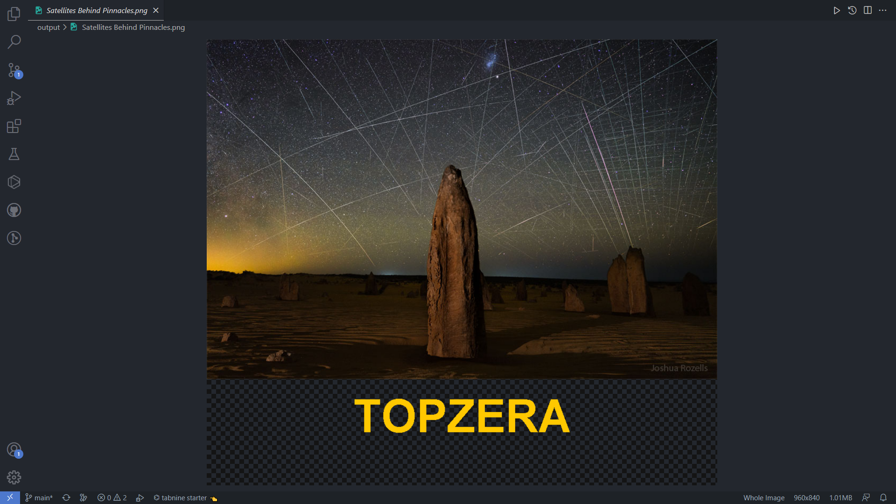

## Objetivo Aula 4:

### Criando nossa própria API com Spring

- Desafios

1. Finalizar o CRUD (Create, Read, Update e Delete) para que se possa atualizar e excluir uma linguagem cadastrada.

2. Devolver a listagem ordenada pelo ranking.

3. Retornar o status 201 quando um recurso (linguagem, no nosso caso) for cadastrado através do POST.

## Prints dos projetos da Aula 3

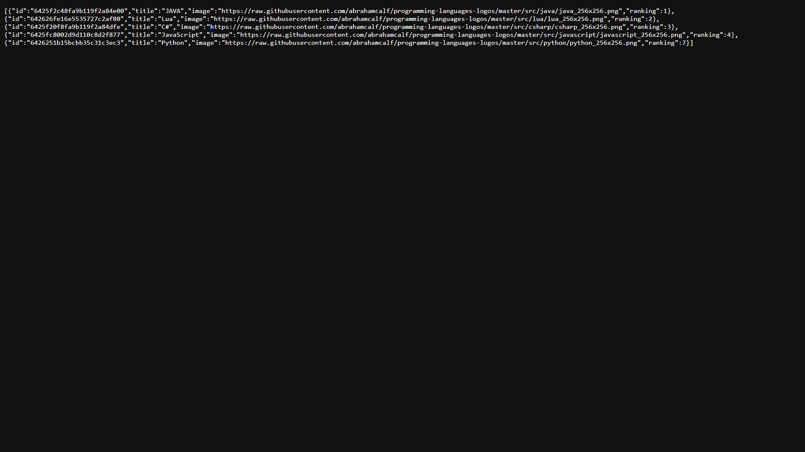

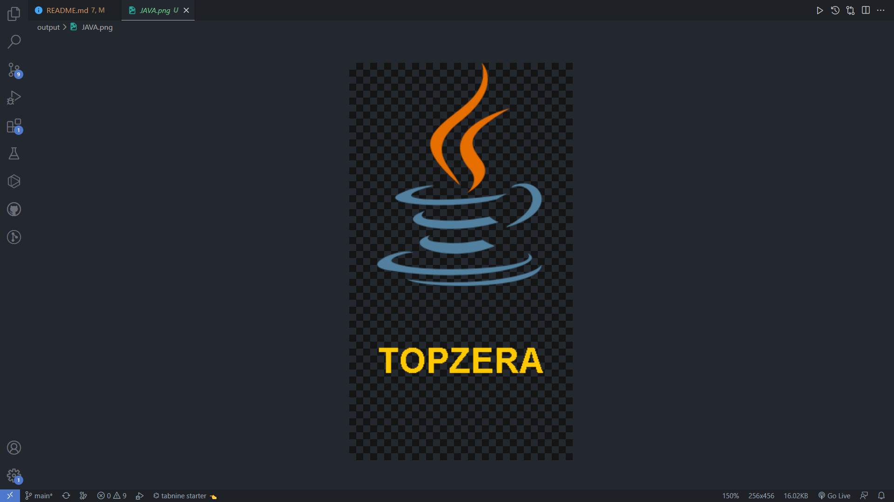

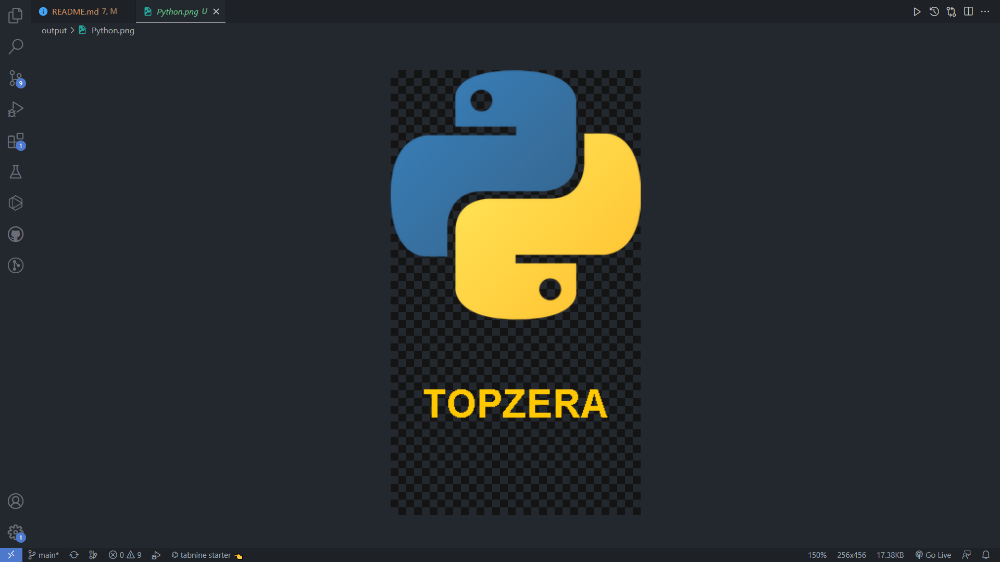

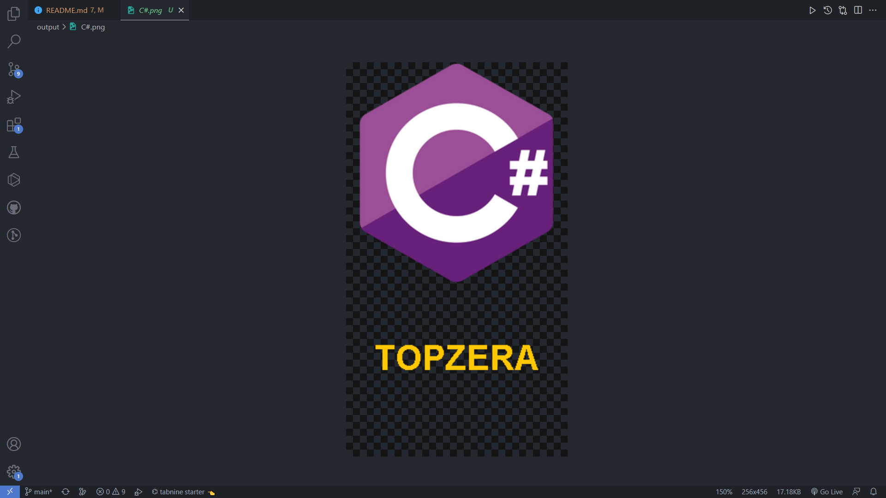
